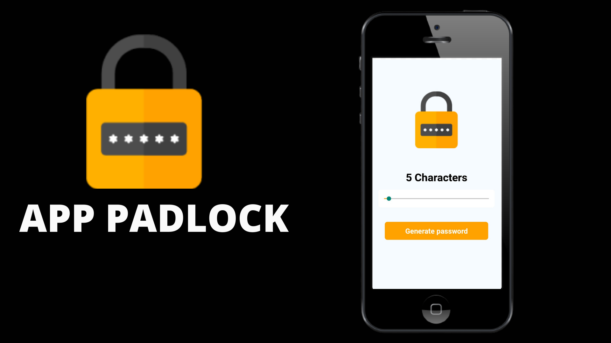

<h1 align="center">
    
  <br><br>
     Projeto padlock
</h1>


<p align="center">
  
<p>

## Sobre

O **Padlock** é uma APP feita para auxiliar os usuários na criaçao de uma senha mais segura. Esta aplicação oferece aos seus clientes uma forma de gerar uma senha que vai de 5 até 15 caracteres, com esse app nossos clientes poderão adicionar quantos caracteres deseja, seguindo o limite de 5 até 15 de sua senha.


## Tecnologias


-  [React Native](http://facebook.github.io/react-native/)
-  [Expo](https://expo.io/)


## Como Executar

- ### **Pré-requisitos**

  - É **necessário** possuir o **[Node.js](https://nodejs.org/en/)** instalado no computador
  - É **necessário** possuir o **[Git](https://git-scm.com/)** instalado e configurado no computador
  - Também, é **preciso** ter um gerenciador de pacotes seja o **[NPM](https://www.npmjs.com/)** ou **[Yarn](https://yarnpkg.com/)**.
  - Por fim, é **essencial** ter o **[Expo](https://expo.io/)** instalado de forma global na máquina

1. Faça um clone do repositório:

```sh
  $ git clone https://github.com/Djaysson/padlock.git
```

2. Executando a Aplicação:

```sh
  # Aplicação mobile
  $ cd padlock
  # Instalando as dependências do projeto.
  $ yarn install # ou npm install
  # Inicie a aplicação mobile
  $ yarn start # ou npm start
```


